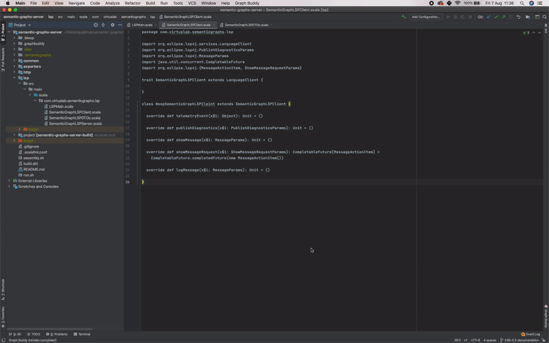
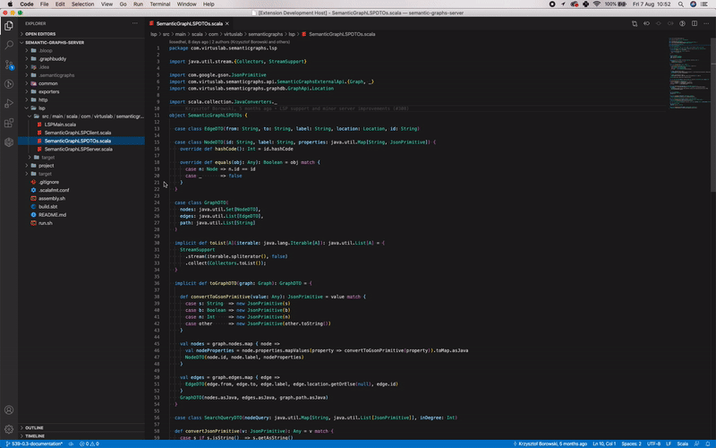
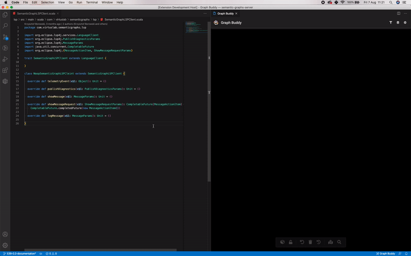
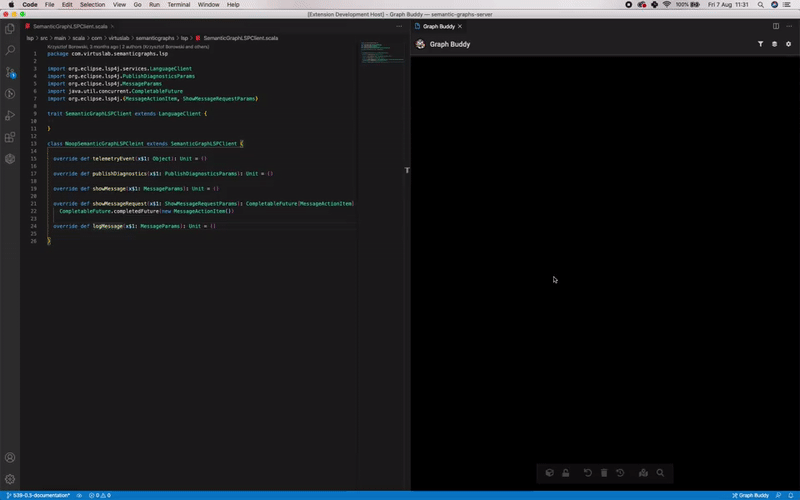
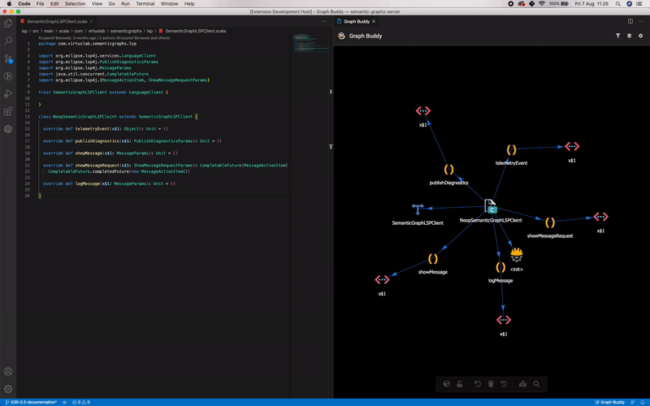
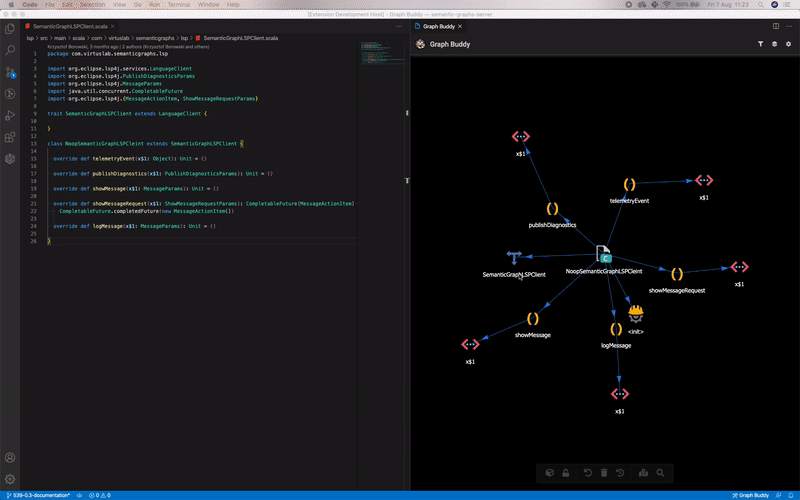

# Say hello to Graph Buddy!

## Your new best pal to help you understand your Scala code better

With today's IDEs, we are all forced to browse code written as text in flatly-structured files, with almost no information about the semantic dependencies between particular code units.
What if we could take a different look and, instead of seeing just source code in text files, go through colorful graph nodes that instantly and clearly show you dependencies and other essential structural bits extracted from your codebase?

## How can Graph Buddy help you?

Graph Buddy aims to speed up your process of reading and learning about source codes. The Graph Buddy plugin provides a set of useful features and techniques that will help you easily browse through twisted code dependencies. At the same time, it gives you a better understanding of the code structure in your codebase.

## How does it work?

During compilation Graph Buddy extracts additional project metadata - Semantic Code Graph files (stored in `.semanticgraphs` folder). These files are consumed and visualized as an interactive graph in the Graph Buddy plugin.


---

# Table of Contents

- [Say hello to Graph Buddy!](#say-hello-to-graph-buddy)
  - [Your new best pal to help you understand your Scala code better](#your-new-best-pal-to-help-you-understand-your-scala-code-better)
  - [How can Graph Buddy help you?](#how-can-graph-buddy-help-you)
  - [How does it work?](#how-does-it-work)
- [Table of Contents](#table-of-contents)
- [Supported languages](#supported-languages)
- [Installing and configuring the extension](#installing-and-configuring-the-extension)
  - [Your project configuration](#your-project-configuration)
    - [Scala configuration](#scala-configuration)
    - [TypeScript configuration (experimental support)](#typescript-configuration-experimental-support)
  - [Installing a plugin](#installing-a-plugin)
- [How to use Graph Buddy](#how-to-use-graph-buddy)
  - [Opening the Graph Buddy board](#opening-the-graph-buddy-board)
    - [IntelliJ](#intellij)
    - [VSCode](#vscode)
    - [Indexing the graph](#indexing-the-graph)
  - [Graph Buddy features](#graph-buddy-features)
    - [Graph Buddy board](#graph-buddy-board)
      - [Navigating through the project](#navigating-through-the-project)
      - [The board](#the-board)
      - [Top navigation bar](#top-navigation-bar)
      - [Bottom buttons](#bottom-buttons)
    - [Advanced queries (very much experimental)](#advanced-queries-very-much-experimental)
- [Roadmap](#roadmap)
  - [Released](#released)
  - [Planned](#planned)
- [Contact us](#contact-us)

---
# Supported languages

⚠ Graph Buddy is an experimental project and currently only supports:

- Scala language - via scalac compiler [plugin](#your-project-configuration) (70% completed)
- TypeScript language - initial experimental support (20% completed)

# Installing and configuring the extension

To make it work, you need to:

1. Configure your project
2. Install the plugin in your IDE

## Your project configuration

The graph files will be generated during the compilation and stored in `.semanticgraphs` folder.

*Note:* You can play around with Graph Buddy using our scala [example](https://github.com/VirtusLab/graphbuddy/tree/master/examples/scala-example). Just open this project inside your IDE (IntelliJ or VSCode) with the Graph Buddy plugin installed (available via IDE official marketplace).

### Scala configuration

The only requirement is the scalac compiler plugin. Configuration for sbt:

```scala
resolvers += Resolver.bintrayRepo("virtuslab", "graphbuddy")
addCompilerPlugin("com.virtuslab.semanticgraphs" % "scalac-plugin" % "0.2.7" cross CrossVersion.full)
scalacOptions += "-Yrangepos"
```

Please remember to recompile the project with a new scalac plugin. In sbt:

```bash
sbt clean test:compile
```

### TypeScript configuration (experimental support)

Typescript data will be generated based on the project configuration defined in `tsconfig.json`:

⚠ Currently, you can play with Typescript, but keep in mind that it is still under active development. There is a lot of work yet to be done to cover all currently unhandled cases. We recommend using a Graph Buddy [ts-example](https://github.com/VirtusLab/graphbuddy/tree/master/ts-example) demonstration repo as a playground.

## Installing a plugin

Make sure you have the following installed:
- [JDK version 11](https://www.oracle.com/technetwork/java/javase/downloads/jdk11-downloads-5066655.html)

The plugin is available for:

- IntelliJ [here](https://plugins.jetbrains.com/plugin/13467-graph-buddy)
- VSCode [here](https://marketplace.visualstudio.com/items?itemName=virtuslab.graph-buddy)

You can install the plugin directly in your IDE - simply navigate to the store inside your IDE and search for `Graph Buddy`.

---

# How to use Graph Buddy

Graph Buddy plugin adds a unique view into your IDE.
You can perform visual operations, both by clicking on your code or on the graph visualization. Doing so will modify the graph structure accordingly, showcasing semantics info about your project.

## Opening the Graph Buddy board

### IntelliJ

Look for a 'GraphBuddy' tab in the bottom right corner and press it.



### VSCode

Click the `GraphBuddy` icon in the activity bar (left), then press the `Open Graph Buddy window` button.
It will open the Graph Buddy board; just wait for the reindexing process to finish and start browsing!



### Indexing the graph

In Intellij and VSCode the graph will be reindexed automatically during the project startup.

To reindex graph manually:

- VSCode - click the desired reindex option in the activity bar (left).
- IntelliJ - search for 'Graph Buddy' in the navigation menu and in the dropdown select "Reindex".

## Graph Buddy features

### Graph Buddy board

#### Navigating through the project

Each declaration or definition is represented as a *node* and the connection between them as an *edge*. When browsing the code, Graph Buddy will update the graph board interactively. Additionally, by right-clicking in a text editor, you can draw the graph for the whole file unit or for a particular definition.



You can perform several interactions on the Graph Buddy board to better understand the code structure. Choose between a range of features like: finding a path between nodes; showing the history of last elements clicked; changing pointing edges direction; filtering by node kind, and many more!





#### The board

1. By clicking on a node, the graph will highlight the corresponding node definition in the source code.
2. By clicking on an edge, the graph will highlight the node usage in the source code.
3. Right-clicking on a node or an edge opens up a context menu that contains additional operations (such as finding method callers or general node usages).
4. By shift-clicking a node, you remove it from the Graph Buddy board.
5. By double-clicking on a node, you extend the graph by adding descending nodes.
6. When hovering over the node or the edge, a tooltip shows up with available data object info.
7. When using a mouse scroll wheel, you either zoom in or out.
8. Pressing `:` opens up a CLI, that works like a *fuzzy search*, searching through network data nodes/edges and their params.

#### Top navigation bar

1. You can filter out some nodes or edges using a filter icon in the navigation bar.
2. You can switch graph layouts (classic, vertical, horizontal) using the navigation bar.
3. In additional settings, by checking/unchecking the `Inward edges` option, you switch between edges modes: inward and outward (edges pointing in or out).
4. In additional settings, `Show non-browsable nodes` checkbox allows you to filter out nodes not directly defined in your source code (e.g., external dependencies, definitions generated by the compiler).

#### Bottom buttons

1. 3D Switcher - a network switcher which toggles network manager between the 2D and 3D graph.
2. Freeze button (lock icon) - freezes current graph, preventing extending it with data or removing data (filtering level still works).
3. Display history (book icon) - displays history of up to 10 last clicked nodes.
4. Clean data (trash icon) - clears network data.
5. Find path (two connected dots icon) - opens up a modal that allows you to select two nodes and it highlights the path between these two nodes.
6. Refresh graph (refresh icon) - refresh graph by redrawing all nodes and edges.
7. Network config (gears icon) - opens up a modal that allows you to customize network filtering options.

### Advanced queries (very much experimental)

Graph Buddy logic is backed up currently by the OrientDB database. We decided to use this feature to allow users experiment and write custom queries. We believe that it might bring some new interesting feedback and ideas as today's search options in IDE are usually nothing more than advanced `grep`. Searching through the graphs let user construct more advanced searches using the power of semantic data and non-trivial node/edge properties or combinations of both.

As an example, let's say you want to find all the places where some particular library is used in your source code. With graph [SQL dialect](https://orientdb.com/docs/3.0.x/sql/) query, it will simply be:

```sql
SELECT FROM E WHERE in IN (SELECT FROM Node WHERE id LIKE "%org\/your\/library%")
```

or you can narrow down the results to visualize only calls to this library:

```sql
SELECT FROM E WHERE in IN (SELECT FROM Node WHERE id LIKE "%org\/your\/library%") AND @class = "CALL"
```

**Advanced queries tree view (VSCode)**

1. `Advanced queries` tree view allows you to write custom queries in the SQL language.
2. Via code lenses in Graph Buddy .sql file you can run the query. The result is presented as graph visualization or in a JSON file.
3. Advanced queries editor saves query files locally in `.graphbuddy` folder and you can manage them (create/rename/delete) directly from the editor.

---

# Roadmap

## Released

- [x]  Semantic Graph extraction based on [semanticdb](https://scalameta.org/docs/semanticdb/guide.html) and [Scala Tree (AST)](https://scalameta.org/docs/trees/guide.html)
- [x]  Graph operations available directly via UI
- [x]  Features improving graph usability
- [x]  Improving semantic graph correctness
- [x]  Embedding the solution to Intellij and VSCode
- [x]  Automatically refreshing the graph on code change
- [x]  Introducing IDE plugin configuration
- [x]  Plug-and-play VSCode server
- [x]  Plug-and-play Intellij server
- [x]  Basic Typescript integration
- [x]  Getting feedback and implementing most requested features
- [x]  Introducing JCEF protocol for IntelliJ plugin and fixing several webview issues.

## Planned

- [ ]  Further graph browsing improvements and optimizations
- [ ]  More plug and play compilations process (eliminating the need for project build definition changes)
- [ ]  Integrating the project with Context Buddy
- [ ]  Improving TypeScript support
- [ ]  Fixing remaining bugs in semantic-graphs scalac compiler plugin

---

# Contact us

We are happy to get constructive feedback that could improve this project!
If you want to help/ask questions, feel free to contact us: `graphbuddy@virtuslab.com`
