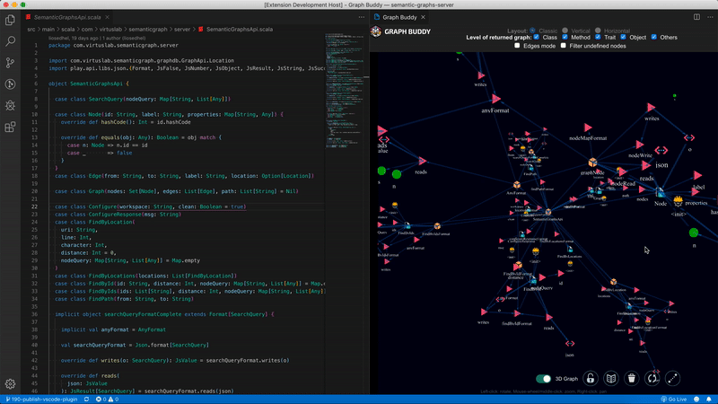
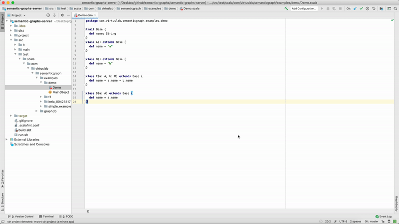
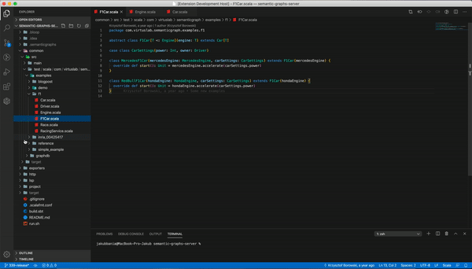
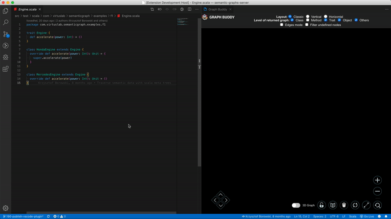
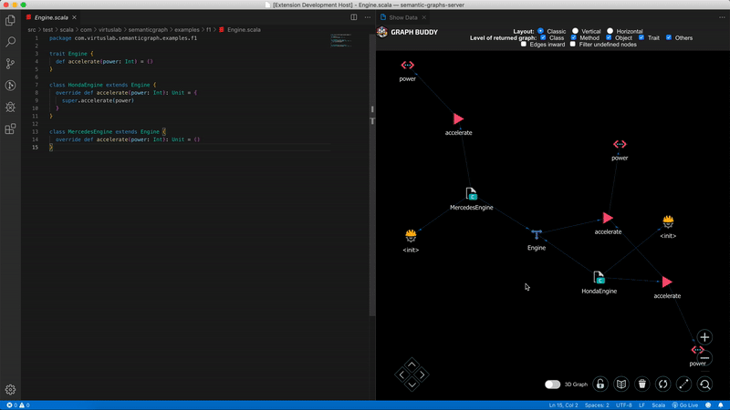
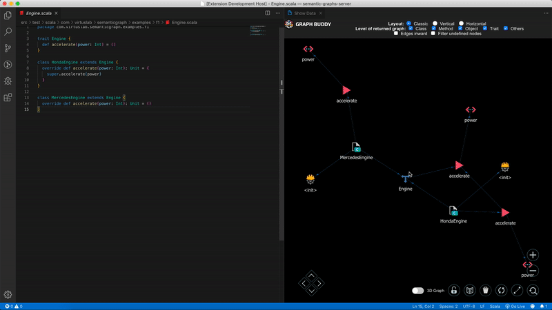
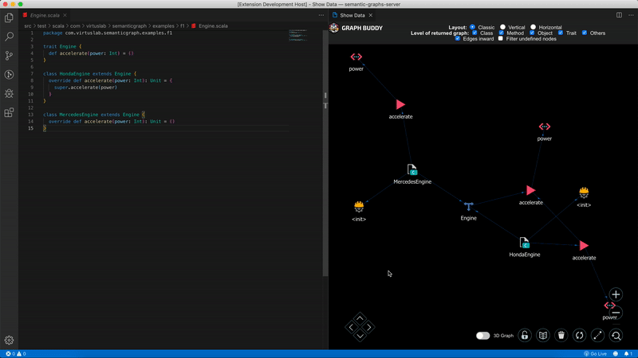

# Say hello to Graph Buddy!

## Your new best pal to help you understand your code better

With today's IDE's we are all forced to browse code by looking at flat-file structures, with almost no information about the semantic dependencies between them.
What if we could take a look at our code from above - and instead of seeing just text files - go through colorful graph nodes that instantly and clearly show you dependencies and other important bits extracted from your codebase?

## How Graph Buddy can help you?

Graph Buddy allows you to extract abstract semantic graph data from your project, giving you more context about the code.
The graph is augmented with additional useful data and features that will help you better understand the structure and connections in your codebase. Graph Buddy aims to speed up your process of reading and learning about the project.


---

# Table of Contents

1. [Installing and configuring the extension](#installing-and-configuring-the-extension)
    - [Your project configuration](#your-project-configuration)
    - [Setting up the server](#setting-up-the-server)
    - [Installing plugin](#installing-a-plugin)
2. [How to use Graph Buddy](#how-to-use-graph-buddy)
    - [Opening Graph Buddy window](#opening-graph-buddy-window)
    - [Basic flow](#basic-flow)
        - [Indexing the graph](#indexing-the-graph)
        - [Navigating throught the project](#navigating-throught-the-project)
        - [Graph Buddy interactions](#graph-buddy-interactions)
    - [Graph Buddy features](#graph-buddy-features)
        - [Code editor](#code-editor)
        - [Webview](#webview)
3. [Roadmap](#roadmap)
4. [Contact us](#contact-us)

---

# Installing and configuring the extension

Graph Buddy extension consist of two parts:

1. Java server - handling all the data
2. IDE plugin - extension downloadable from VSCode & IntelliJ store

To make it work, you need to go through three installation steps:

1. Configure your project
2. Download and set up the server
3. Install the plugin in your IDE

## Your project configuration

*NOTE:* GraphBuddy is currently only supporting scala projects

### Using graphbuddy scalac plugin

For maximum server indexing performance, recommended way of generating graph data is via the graphbuddy scalac plugin. For example, using sbt in your `build.sbt`:
```
resolvers += Resolver.bintrayRepo("virtuslab", "graphbuddy")
addCompilerPlugin("com.virtuslab.semanticgraphs" % "scalac-plugin" % "0.0.10" cross CrossVersion.full)
scalacOptions += "-Yrangepos"
```

Graph Files will be generated during the compilation and stored in `.semanticgraphs` folder.

## Setting up the server

Make sure you have the following installed:
- [JDK version 11 ](https://www.oracle.com/technetwork/java/javase/downloads/jdk11-downloads-5066655.html)

To run the server, download and run following `.jar`
- [Graph Buddy server](https://dl.bintray.com/virtuslab/graphbuddy/semantic-graphs-server-0.0.2.jar)

Run the server:
```
java -jar semantic-graphs-server-0.0.1.jar 9000
```

*Note:* 9000 is a default http port for the server

## Installing a plugin

Plugin is available for:
- VSCode [here](https://marketplace.visualstudio.com/items?itemName=virtuslab.graph-buddy)
- IntelliJ [here](https://plugins.jetbrains.com/plugin/13467-graph-buddy)

You can install the plugin directly in your IDE - simply navigate to store inside your IDE and search for `Graph Buddy`.

---

# How to use Graph Buddy

Graph Buddy plugin adds a special view into your IDE.
You can perform visual operations, both clicking on your code and on the graph visualization. Doing so will modify the graph structure accordingly, showcasing semantics info about your project.

## Opening Graph Buddy window

**IntelliJ**

Look after a 'GraphBuddy' tab in the bottom right corner and press it.



**VSCode**

Open `Command Palette` and type `> GraphBuddy: Show webview window`



## Basic flow

### Indexing the graph

Before doing any operations with the plugin, you have to reindex semantic graph. Simply, in your IDE:
- VSCode - open context menu by right-clicking and press "Reindex Semantic Graph"
- IntelliJ - search for 'Graph Buddy' in the navigation menu and in the dropdown select "Reindex Semantic Graph"

**Keep in mind that you have to reindex semantic graph only once per server start**

### Navigating throught the project

When clicking on code, Graph Buddy will add data accordingly to your code. Each semantic type in your code is represented as *node* and the connection between them as *edge*. When navigating, the graph will progressively get bigger, showing all the semantic connections inside your project.



### Graph Buddy interactions

You can perform several interactions on the webview, that will help you understand the project semantics better. Choose between a range of features like: find path between nodes, show history of last 5 clicked elements, change pointing edges direction, filter by node kind, and many more!





## Graph Buddy features

### Code editor

1. When clicking inside code editor, corresponding nodes and connected to it edges will highlight
2. By right-clicking on code, you have an option to render graph for both file and location, which will display either full graph per file or all connections for current location/symbol
3. By opening extension menu from menu bar (IntelliJ) or right clicking (VSCode) you can reindex graph, which will reindex graph data source

### Webview

1. By clicking on nodes, graph will highlight corresponding nodes and edges
2. By clicking on edges that contain a *reference* parameter, IDE focuses on code responsible for both nodes connected by clicked edge.
3. By shift-clicking node, you remove it from the webview
4. By double clicking on node you extend the graph by adding data corresponding with clicked node
5. By switching layout in the navigation bar, you change rendering method of the graph (classic, vertical, horizontal)
6. By selecting and unselecting level of returned graph checkboxes, you filter out corresponding nodes by kind.
7. By checking / unchecking Inward checkbox, you switch between edges modes: inward and outward (edges pointing in or out)
8. When hovering on a node or edge, a tooltip shows up with available data object info
9. When using mouse scroll wheel, you either zoom in or out
10. By checking Filter undefined nodes checkbox, you filter out nodes marked as undefine
11. Pressing `:` opens up a CLI, that works like a *fuzzy search*, searching through network data nodes / edges and their params

**Interface buttons**
1. 3D Switcher - a network switcher, changing network manager between 2d and 3d graph (VSCode only!)
2. Freeze button (lock icon) - freezes current graph, not allowing to extend it with data or remove data (filtering level still works)
3. Display history (book icon) - displays history of up to last 5 clicked nodes
4. Clean data (trash icon) - clears network data
5. Find path (two connected dots icon) - opens up a model that allows to select two nodes, then upon accepting, it highlights path between these two nodes
6. Refresh graph (refresh icon) - refresh graph by redrawing all nodes and edges

**... and extra interface icons in 2d manager:**
1. Arrow icons - helps to navigate up/down/left/right through graph
2. Zoom in / out icons - zooms graph in / out
3. Reset zoom (magnifying glass icon) - resets graph zoom

---

# Roadmap

**Release**
- [x]  Semantic Graph extraction based on [semanticdb](https://scalameta.org/docs/semanticdb/guide.html) and [Scala Tree (AST)](https://scalameta.org/docs/trees/guide.html)
- [x]  Graph operations available directly via UI
- [x]  Features improving graph usability
- [x]  Improving semanticdb graph correctness
- [x]  Embedding the solution to Intellij and VSCode
- [x]  Automatically refreshing the graph on code change
- [x]  Introduce IDE plugin configuration
- [ ]  Plug-and-play server

**Future versions**
- [ ]  Getting feedback and implementing most requested features
- [ ]  Integrating the project with Context Buddy
- [ ]  Typescript integration

---

# Contact us

We are happy to get any feedback, that could improve our project!
If you want to help/ask questions, feel free to contact us: `graphbuddy@virtuslab.com`
