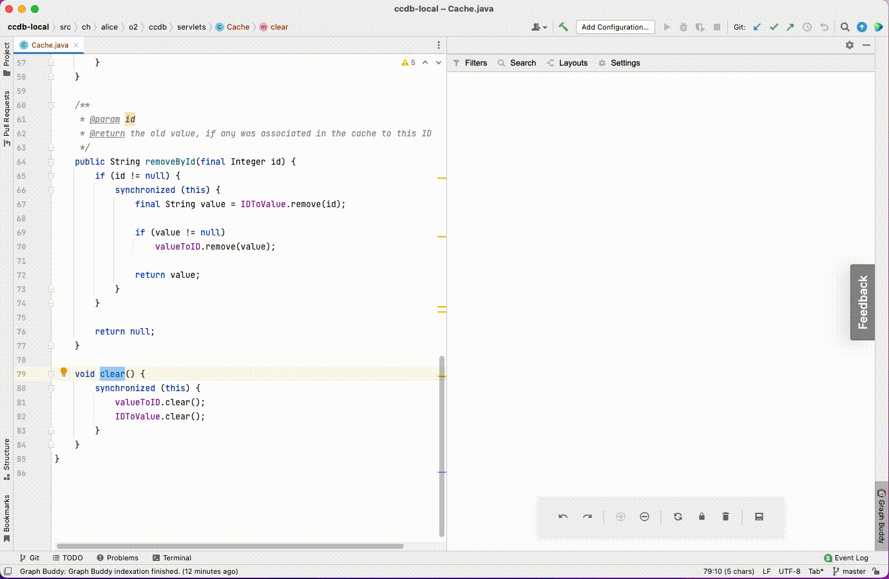
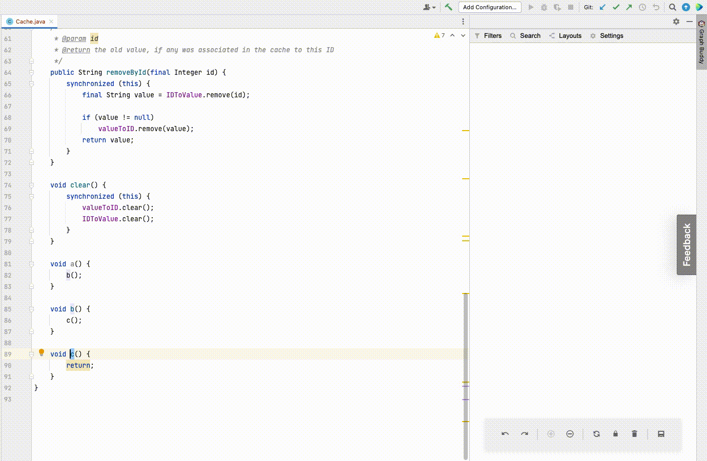

# Say hello to Graph Buddy!

## Your new best pal to help you understand your Java and Scala code better

With today's IDEs, we are all forced to browse code written as text in flatly-structured files, with
almost no information about the semantic dependencies between particular code units. What if we
could take a different look and, instead of seeing just source code in text files, go through
colorful graph nodes that instantly and clearly show you the structure of your code extracted from your codebase?

## How can Graph Buddy help you?

Graph Buddy aims to speed up your process of reading and learning your source code. The Graph
Buddy plugin provides a set of useful features and techniques that will help you easily browse
through twisted code dependencies. At the same time, it gives you a better understanding of the code
structure in your codebase.


---

# Table of Contents

- [Say hello to Graph Buddy!](#say-hello-to-graph-buddy)
  - [Your new best pal to help you understand your Java and Scala code better](#your-new-best-pal-to-help-you-understand-your-java-and-scala-code-better)
  - [How can Graph Buddy help you?](#how-can-graph-buddy-help-you)
- [Table of Contents](#table-of-contents)
- [Supported languages](#supported-languages)
  - [Configuration for Java projecs](#configuration-for-java-projects)
  - [Configuration for Scala projecs](#configuration-for-scala-projects)
  - [Installing a plugin](#installing-a-plugin)
- [How to use Graph Buddy](#how-to-use-graph-buddy)
  - [Opening the Graph Buddy board](#opening-the-graph-buddy-board)
    - [IntelliJ](#intellij)
    - [VSCode](#vscode)
    - [Indexing the graph](#indexing-the-graph)
  - [Graph Buddy features](#graph-buddy-features)
    - [Adding nodes to the graph](#adding-nodes-to-the-graph)
    - [Filters, layouts, search](#filters-layouts-search)
    - [Saving state](#saving-state)
    - [Graph files regeneration and reindexing](#graph-files-regeneration-and-reindexing)
    - [Advanced options](#advanced-options)
- [Roadmap](#roadmap)
  - [Released](#released)
  - [Planned](#planned)
- [Telemetry](subpages/telemetrySettings.md)
- [Privacy policy](subpages/privacyPolicy.md)
- [Contact us](#contact-us)

---

# Supported languages

Graph Buddy is still under development and currently only supports:

- Java - with dynamic file parsing. Versions up to Java 11 are supported (with some experimental support for versions up to Java 16).
- Scala - via our scalac compiler [plugin](#your-project-configuration)

## Configuration for Java projects

Java is supported out-of-the-box, no extra configuration is necessary. You just need to install our plugin and it will automatically generate graph files for the currently open project on startup. The initial graph generation may take a few minutes for larger projects. If you change something in the code, the plugin will update the graph automatically. However, some changes (like changing the branch, removing multiple files at once) might not be propagated correctly. If you notice that the plugin isn't working correctly (for example, if some nodes or edges aren't pointing to the right locations or aren't present at all), you can consider regenerating the graph files. To do so, please click the `Generate Java graph` action from the `Graph Buddy` menu. 

## Configuration for Scala projects

Here, except for installing the plugin in IDE, you need to configure your scala compiler. GraphBuddy has a plugin to it, which will generate graph files during compilation.

For sbt you can use sbt plugin. Just create plugin file `project/graphbuddy.sbt` with the content:

```scala
addSbtPlugin("org.virtuslab.semanticgraphs" % "sbt-plugin" % "0.2.15")
```

or add scalac compiler plugin directly:

```scala
addCompilerPlugin("org.virtuslab.semanticgraphs" % "scalac-plugin" % "0.2.15" cross CrossVersion.full)
scalacOptions += "-Yrangepos"
```

Please remember to recompile the project with a new scalac plugin. In sbt:

```bash
sbt clean test:compile
```

Graph Buddy currently supports the following scala versions:

- 2.13.7
- 2.13.6
- 2.13.5
- 2.13.4
- 2.13.3
- 2.13.2
- 2.13.1
- 2.13.0
- 2.12.14
- 2.12.13
- 2.12.12
- 2.12.11
- 2.12.10
- 2.12.9
- 2.12.8
- 2.11.12

## Installing a plugin

Make sure you have the following installed:

- [JDK version 11](https://www.oracle.com/technetwork/java/javase/downloads/jdk11-downloads-5066655.html).

The plugin is available for:

- IntelliJ [here](https://plugins.jetbrains.com/plugin/13467-graph-buddy),
- VSCode [here](https://marketplace.visualstudio.com/items?itemName=virtuslab.graph-buddy).

You can install the plugin directly in your IDE - simply navigate to the store inside your IDE and
search for `Graph Buddy`.

---

# How to use Graph Buddy

Graph Buddy plugin adds a unique view into your IDE. You can perform visual operations, both by
clicking on your code or on the graph visualization. Doing so will modify the graph structure
accordingly, showcasing semantics info about your project.

## Opening the Graph Buddy board

### IntelliJ

Look for a 'Graph Buddy' tab in the bottom right corner and press it.


### VSCode

Click the `Graph Buddy` icon in the activity bar (left), then press the `Open Graph Buddy window`
button. It will open the Graph Buddy board; just wait for the reindexing process to finish and start
browsing!


### Indexing the graph

The graph will be reindexed automatically during the project startup if there are any graph files in the `.semanticgraphs` folder.

To reindex graph manually:

- VSCode - click the desired reindex option in the activity bar (left).
- IntelliJ - search for 'Graph Buddy' in the navigation menu and in the dropdown select "Reindex".

## Graph Buddy features

**NOTE: The plugin is optimised for working in the default, 2D mode. Some features may not correctly (or even at all) in 3D mode.**



### Adding nodes to the graph

You can do this in multiple ways. The most intuitive is clicking on the code - then the corresponding node should appear on plugin canvas.

The second way is using options from the context menu in the editor or on canvas. In the editor, there are some options to generate the whole graph for a selected place in the code.


You can check where a given node is called using node context actions Called by & Call hierarchy. You can also find paths between nodes already added to the graph.



### Filters, layouts, search

You can filter elements of a particular type using the menu on the top of the Graph Buddy panel. Layouts can help you organize nodes on the canvas. Finally, using search you can highlight elements matching the search phrase on the canvas. You can search by a part of the node name or by node type (i.e. `CLASS`).


### Saving state

If you want to preserve the current graph state for later use (i.e. to present it to your colleague), you can do this by clicking on the floppy disk icon on the toolbar. There you can save a snapshot of your current work or load a previously saved snapshot. You can find those snapshots in the `.graphbuddy` folder.


### Graph files regeneration and reindexing

If you are working with a Java project, then under some circumstances (switching branches, applying a code patch, editing or removing multiple files at once) some graph files may become outdated and as a result, the plugin may not work as expected (nodes and edges may be missing from the graph or pointing to incorrect locations in the code). There currently is no automated detection for these cases. When in doubt, you should trigger the `Generate graph` action from the Main Menu to make sure you are working with up-to-date graph files.
If you are working with a Scala project, assuming you have configured the compiler plugin correctly, you should manually trigger the `Reindex graph` action from the Main Menu. This will load the newly generated graph files to the plugin.


### Advanced options
#### Graph canvas

<table>
  <tr>
    <td>Graph highlighting</td>
    <td>By clicking on nodes or edges, the graph will highlight corresponding nodes and edges</td>
  </tr>
  <tr>
     <td>Graph data styles</td>
     <td>Each data object has its own unique styling</td>
  </tr>
  <tr>
    <td>Removing data</td>
    <td>By shift-clicking node (or choosing the option in context menu), you remove it from the webview</td>
  </tr>
  <tr>
    <td>Adding data to the graph</td>
    <td>By double-clicking on the node you extend the graph by adding data corresponding with clicked node</td>
  </tr>
  <tr>
    <td>Data positioning</td>
    <td>By dragging nodes you position them on the canvas</td>
  </tr>
  <tr>
    <td>Info on hover</td>
    <td>By hovering over node/edge, a popup appears that contains some additional info about a targeted data object</td>
  </tr>
  <tr>
    <td>Context menu</td>
    <td>By right-clicking on canvas, you open up a context menu with options depending on clicked data: node, edge, data kind, or background</td>
  </tr>
  <tr>
    <td>Flash messages</td>
    <td>By performing various actions, flash message will display above interface buttons panel</td>
  </tr>
</table>

#### Navigation bar

<table>
  <tr>
    <td>Filters</td>
    <td>By clicking the buttons in the filtering menu, you toggle visibility of the corresponding node/edge kind</td>
  </tr>
  <tr>
    <td>Layouts</td>
    <td>By switching layout in the navigation bar (layers icon), you change the rendering method of the graph (classic, vertical, horizontal)</td>
  </tr>
  <tr>
    <td>Search</td>
    <td>You can search for elements on the canvas, e.g. `Class`, `Method` or node name (like `get`).</td>
  </tr>
  <tr>
    <td>Settings</td>
    <td>By selecting additional network options, you can adjust graph visibility and the amount of visible information to your liking. You can also switch the view between 2d and 3d.</td>
  </tr>
</table>

#### Interface buttons

<table>
  <tr>
    <td>Undo/Redo</td>
    <td>Undo or redo action on the graph</td>
  </tr>
  <tr>
    <td>Zoom</td>
    <td>Zoom in or out</td>
  </tr>
  <tr>
    <td>Reorganise graph</td>
    <td>By clicking the reorganise graph button, you reorganise network nodes positions</td>
  </tr>
  <tr>
    <td>Freeze graph</td>
    <td>By clicking the `freeze graph` button, you lock the graph, temporarily disallowing any updates to its data</td>
  </tr>
  <tr>
    <td>Clear graph</td>
    <td>By clicking the `clear network data graph` button, you clear all existing graph data</td>
  </tr>
  <tr>
    <td>Graph file manager</td>
    <td>By clicking the graph file manager button, you open up a modal that allows you to save the current graph data snapshot or load it, from a file; the default location is /workspace/.graphbuddy</td>
  </tr>
</table>

#### Keyboard shortcuts

<table>
  <tr>
    <td>Revert action</td>
    <td>By pressing 'ctrl+z' you revert last action (add/update/remove/re-position)</td>
  </tr>
  <tr>
    <td>Redo action</td>
    <td>By pressing 'ctrl+shift+z' you redo the last undone action (add/update/remove/re-position)</td>
  </tr>
  <tr>
    <td>Close modal</td>
    <td>By pressing 'esc' you close the currently active modal</td>
  </tr>
</table>

---

# Roadmap

## Released

- [x] Semantic Graph extraction based on
      [semanticdb](https://scalameta.org/docs/semanticdb/guide.html) and
      [Scala Tree (AST)](https://scalameta.org/docs/trees/guide.html)
- [x] Graph operations available directly via UI
- [x] Improving semantic graph correctness
- [x] Embedding the solution to Intellij and VSCode
- [x] Support for Java
- [x] Automatically refreshing the graph on code change

## Planned

- [ ] Fixing remaining bugs in Java support

---

# Contact us

We are happy to get constructive feedback that could improve this project! If you want to help/ask
questions, feel free to contact us: `graphbuddy@virtuslab.com`
