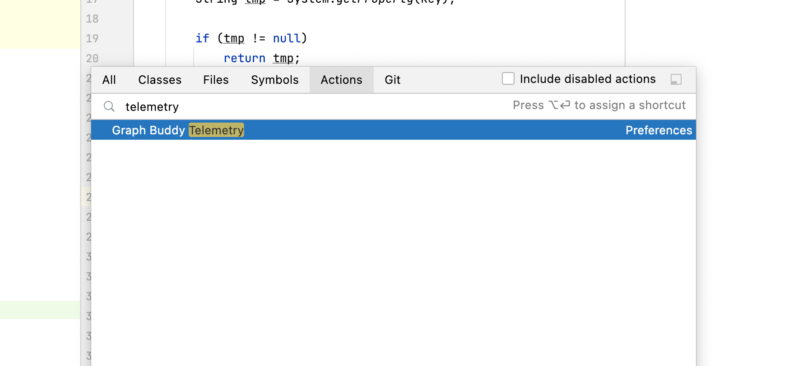
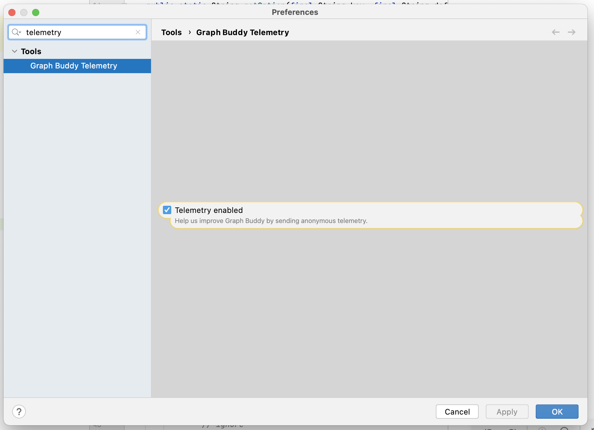
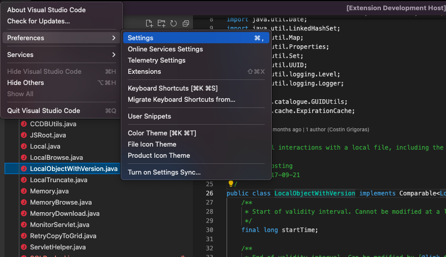
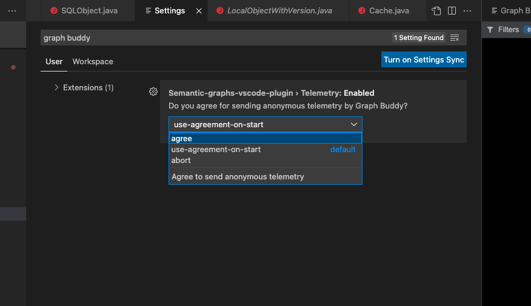

# Telemetry

With your agreement, we can collect some anonymous information. If you change your mind, you can change telemetry settings following instructions below.

## IntelliJ

In IntelliJ open `Find action` and type `Telemetry`. Then you should see `Graph Buddy Telemetry` entry - open it.

Then you can change settings:

## VSCode

In VSCode open settings in following way:

And set them as you wish.

